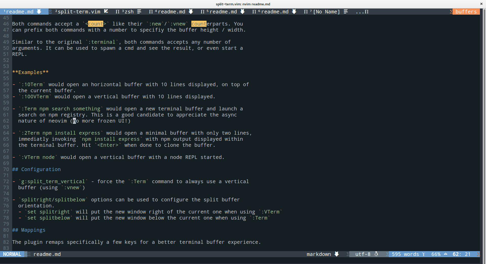

<h1 align="center">
  
  <br>
  <br>
</h1>

Utilites around neovim's `:terminal`.

One of the coolest feature of neovim is its xterm-like terminal emulator. See
`:help nvim-terminal-emulator`.

> One feature that distinguishes Nvim from Vim is that it implements a mostly
complete VT220/xterm-like terminal emulator. The terminal is presented to the
user as a special buffer type, one that is asynchronously updated to mirror
the virtual terminal display as data is received from the program connected
to it. For most purposes, terminal buffers behave a lot like normal buffers
with 'nomodifiable' set.

This help page also comes with a bunch of tips and recommandation. Indeed, the
initial user experience within a terminal Buffer is not perfect:

- No easy way to switch back to normal mode. Hitting `a`, `i` or any key that
  would enter insert mode allows sending input to the command, but there's no
  easy way to switch back (for instance to close the buffer with `:q`). The
  `<C-\><C-n>` key combo is the defaults.

- `:term` will open a terminal buffer, **in** the current buffer, which is
  often not wanted. It uses `:enew` by default whereas `:new` or `:vnew` might
  be more appropriate.

- Navigating to nearby buffer / windows is not easy / handy. Maps like `<C-w>w`
  are inactive in favor of the terminal implementation (which is in this case
  delete previous word)

- Pasting content in terminal can be troublesome. This plugin makes it a little
  bit easier to paste content in terminal mode using `<C-v>`.

This plugin aims to alleviate some of these issues, for a better terminal
buffer experience.



## Install

Install this plugin using your favorite plugin manager, or manually by
extracting the files in your `~/.vim` or `~/.config/nvim` directory.

    Plug 'vimlab/split-term.vim'

## Commands

- **`:Term`** Opens a new terminal buffer using `:new` (splits horizontally)
- **`:VTerm`** Opens a new terminal buffer using `:vnew` (splits vertically)
- **`:TTerm`** Opens a new terminal buffer using `:tabnew` (new tab)

Both `:Term` and `:VTerm` commands accept a `<count>` like their `:new`/`:vnew`
counterparts. You can prefix both commands with a number to specifiy the buffer
height / width.

Similar to the original `:terminal`, both commands accepts any number of
arguments. It can be used to spawn a cmd and see the result, or even start a
REPL.

**Examples**

- `:10Term` would open an horizontal buffer with 10 lines displayed, on top of
  the current buffer.

- `:100VTerm` would open a vertical buffer with 10 lines displayed, right of
  the current buffer.

- `:Term npm search something` would open a new terminal buffer and launch a
  search on npm registry. This is a good candidate to appreciate the async
  nature of neovim (no more frozen UI!)

- `:2Term npm install express` would open a minimal buffer with only two lines,
  immediatly invoking `npm install express` with npm output displayed within
  the terminal buffer. Hit `<Enter>` when done to close the buffer.

- `:VTerm node` would open a vertical buffer with a node REPL started.

## Configuration

`splitright/splitbelow` options can be used to configure the split buffer
  orientation.
  - `set splitright` will put the new window right of the current one when using `:VTerm`
  - `set splitbelow` will put the new window below the current one when using `:Term`

`g:split_term_default_shell` - enables shell configuration specific to
  split-term. It lets vim's `shell` configuration free to let other plugins
  that might need it (such as ale or neomake) and works nicely [with Windows
  Subsystem for Linux](https://docs.microsoft.com/en-us/windows/wsl/about).
  Example:

```vim
let g:split_term_default_shell = "bash"
```

`g:split_term_vertical` - force the `:Term` command to always use a vertical
  buffer (using `:vnew`)

`g:disable_key_mappings` - disable key mappings of the plugin

## Mappings

The plugin remaps specifically a few keys for a better terminal buffer experience. This
behaviour can be disabled using `g:disable_key_mappings`.

- `<Esc>` - Switch to normal mode (instead of `<C-\><C-n>`)
- Bind Alt+hjkl, Ctrl+arrows to navigate through windows (eg. switching to buffer/windows left, right etc.)
  - `Alt+h` - does a `<C-w>h`
  - `Alt+j` - does a `<C-w>j`
  - `Alt+k` - does a `<C-w>k`
  - `Alt+l` - does a `<C-w>l`
  - `Ctrl+Left` - does a `<C-w>h`
  - `Ctrl+Down` - does a `<C-w>j`
  - `Ctrl+Up` - does a `<C-w>k`
  - `Ctrl+Right` - does a `<C-w>l`
  - `Ctrl+v` - copy-pasting, does a `<C-\><C-N>pi`


# Changelog

## [Unreleased](https://github.com/vimlab/split-term.vim/compare/v1.0.3...HEAD)

### Commits

- readme: add changelog and Ctrl+v mapping to readme [`6cea1a3`](https://github.com/vimlab/split-term.vim/commit/6cea1a3f6f7ad57f6796f6c544a7567242d9777c)

## [v1.0.3](https://github.com/vimlab/split-term.vim/compare/v1.0.2...v1.0.3) - 2018-09-28

### Commits

- npm: add auto-changelog to generate, well a changelog [`e6c4179`](https://github.com/vimlab/split-term.vim/commit/e6c41795d973b4f358d25a093e4b5ccc4205d821)

## [v1.0.2](https://github.com/vimlab/split-term.vim/compare/v1.0.1...v1.0.2) - 2018-09-28

### Commits

- feat: add TTerm command to open terminal in a new tab [`836f514`](https://github.com/vimlab/split-term.vim/commit/836f5143e2c3781a38e492027604a74a19960103)
- Add MIT license [`eb1dc3b`](https://github.com/vimlab/split-term.vim/commit/eb1dc3b6e9789d7f394b54da611e2e08f98d0eec)
- .gitignore [`28d1899`](https://github.com/vimlab/split-term.vim/commit/28d189951b3841e954c5a2d3ca2c3415acfb6712)

## v1.0.1 - 2018-09-27

### Merged

- make key mappings optional [`#3`](https://github.com/vimlab/split-term.vim/pull/3)

### Commits

- mappings: easier time pasing content using <C-v> [`bb20d81`](https://github.com/vimlab/split-term.vim/commit/bb20d815e019357faf1777b6da18b832630fedfe)
- feat: add split_term_default_shell option [`148f571`](https://github.com/vimlab/split-term.vim/commit/148f5718bd3b1c72aa1a8fce409b0fd5a3e75a87)
- Fix a few typos [`ab0f21a`](https://github.com/vimlab/split-term.vim/commit/ab0f21a2bff54434847176efda654ab6537de538)
- Init [`1e19ce3`](https://github.com/vimlab/split-term.vim/commit/1e19ce37b64e61ecb922db02edebdd900e7f81d8)

---

License [MIT](./LICENSE)

